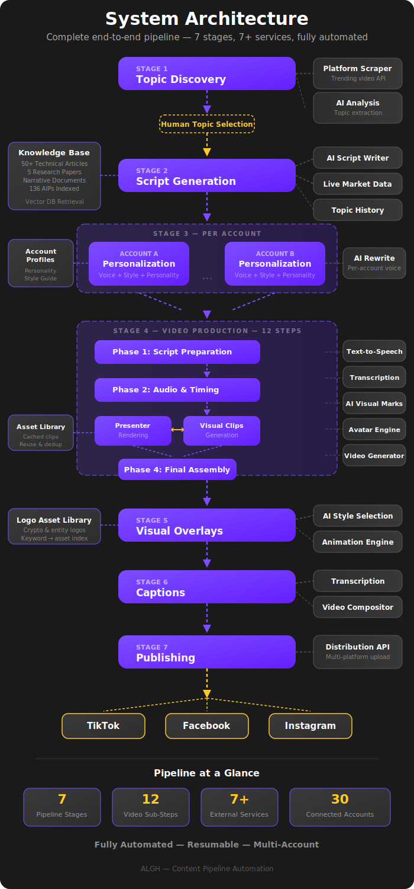

# Content Pipeline

## Automated Content Creation at Scale

The Content Pipeline is a fully automated system that transforms trending social media topics into publish-ready short-form video content. From identifying what's trending to producing a polished, captioned video with branded overlays — the entire process is orchestrated end-to-end with minimal manual intervention.

---

## What This System Does

At its core, the pipeline answers a simple question: **"What's trending right now, and how do we turn that into a video — fast?"**

It handles every step of the process:

1. **Discovers** what topics are gaining traction across social platforms
2. **Writes** an informed, research-backed narration script
3. **Personalizes** that script to match a specific account's voice and style
4. **Produces** a full video with a talking-head presenter and supporting visuals
5. **Enhances** the video with branded logo animations and word-by-word captions
6. **Publishes** the finished video across multiple platforms

What would normally require a content researcher, scriptwriter, video editor, and social media manager is handled by a single automated pipeline.

---

## Why This Exists

Before this system, content production was a manual, time-intensive process. Each video required hours of research, writing, editing, and formatting — and that was for a single account. Scaling to multiple accounts with different voices and styles was simply not feasible by hand.

This pipeline was built to solve that problem. It takes the entire workflow — from trend discovery to finished video — and automates it into a repeatable, scalable process.

---

## System Architecture

<figure style="text-align: center;">
  
</figure>

---

## How This Documentation Is Organized

| Section | What It Covers |
|---------|---------------|
| **Pipeline Overview** | The big picture — how all the stages connect from start to finish |
| **Pipeline Stages (1–7)** | A dedicated page for each stage of the pipeline, explaining what it does and why it matters |
| **Multi-Account Scaling** | How the system handles multiple accounts with different voices, styles, and audiences |
| **Technology Stack** | A summary of the services and tools that power the pipeline |

!!! note "A Living Document"
    This documentation will continue to evolve. Future revisions will include visual flowcharts, diagrams, and a history section covering the original manual process that this pipeline replaced.

---

ALGH — Content Pipeline Automation

