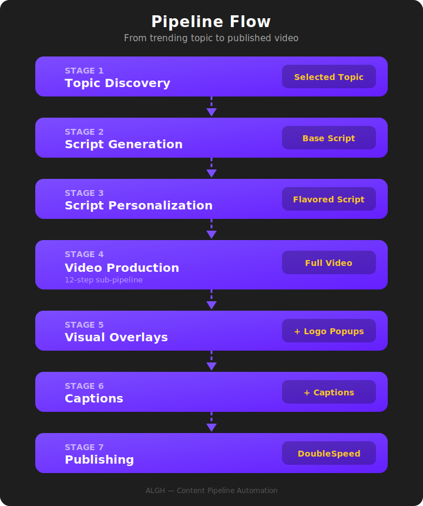

# Pipeline Overview

## From Trending Topic to Published Video

The Content Pipeline is a multi-stage system where each stage feeds directly into the next. A trending topic enters the pipeline and — through a series of automated steps — exits as a fully produced, platform-ready video.

This page provides the high-level view. Each stage has its own dedicated page with more detail.

---

## The Stages at a Glance

| Stage | Name | What Happens |
|-------|------|-------------|
| **1** | Topic Discovery | Scans social platforms for trending topics and surfaces the most relevant ones |
| **2** | Script Generation | Writes an informed narration script backed by a curated knowledge base and live data |
| **3** | Script Personalization | Rewrites the script to match a specific account's voice, tone, and style |
| **4** | Video Production | Produces the full video — talking-head presenter, supporting visuals, and narration audio |
| **5** | Visual Overlays | Adds branded logo animations that appear when relevant entities are mentioned |
| **6** | Captions | Burns in word-by-word animated captions synced to the narration |
| **7** | Publishing | Distributes the finished video across TikTok, Instagram, and Facebook |

---

## How It All Connects

The pipeline follows a strict sequential flow. Each stage produces an output that becomes the input for the next stage.

<figure style="text-align: center;">
  
</figure>

---

## What Makes This Complex

On the surface, "turn a topic into a video" sounds straightforward. In practice, it involves coordinating **7+ external services**, managing **dozens of intermediate files**, and orchestrating processes that run in parallel to optimize for both speed and cost.

A few things that set this system apart:

- **Research-Backed Scripts** — Scripts aren't just generated from thin air. They're informed by a curated knowledge base of 50+ articles and research papers, combined with live market data pulled at generation time.

- **Intelligent Video Rendering** — The video production stage alone is a 12-step sub-pipeline that uses smart rendering optimization to dramatically reduce production costs while maintaining quality.

- **Account-Aware Personalization** — The same trending topic produces a different video for each account. Voice, tone, pacing, visual avatar, and narration style are all customized per account.

- **Precision-Synced Enhancements** — Logo overlays and captions aren't just slapped on. They're synced to the narration at the word level using audio transcription and intelligent timestamp matching.

- **Fully Resumable** — If any stage fails or needs adjustment, the pipeline can pick up exactly where it left off without re-running earlier stages.

---

## For a Single Account

When the pipeline runs for one account, it follows the full sequence above. The result is a single finished video — personalized to that account's voice, enhanced with overlays and captions, and ready for publishing.

Every run is tracked and stored with all intermediate outputs, so any stage can be reviewed, adjusted, or re-run independently.

---

## For Multiple Accounts

The pipeline is designed to scale across multiple accounts. Each account has its own identity — its own voice, personality, visual style, and audience. When the same trending topic is processed for different accounts, **each one gets a uniquely personalized video**.

The multi-account architecture is covered in detail on the [Multi-Account Scaling](multi-account.md) page.

---

ALGH — Content Pipeline Automation

