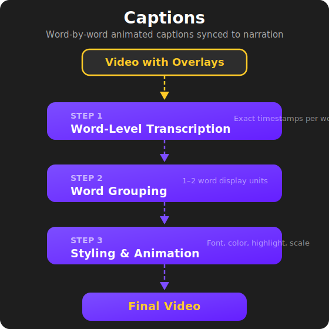

# Stage 6: Captions

## Word-by-Word Animated Captions

The final production stage adds **animated, word-by-word captions** synced precisely to the narration. These aren't static subtitles — they're styled, animated text overlays designed specifically for the short-form video format that audiences expect on platforms like TikTok.

---

## How It Works

### Transcription

The video's audio is transcribed with word-level precision, producing an exact timestamp for the start and end of every single word in the narration. This timestamp data is the foundation for syncing captions to speech.

### Word Grouping

Rather than flashing one word at a time (too fast to read) or showing full sentences (too much text on screen), the system groups words into **1–2 word display units**. Short words are paired together when they fit naturally; longer words stand alone.

This creates a reading rhythm that matches how the narration sounds — the captions feel like they're keeping pace with the speaker, not racing ahead or lagging behind.

### Styling

The captions are styled to match the look and feel of professional TikTok content:

- **Bold, clean font** designed for readability on mobile screens
- **High contrast** — white text with a dark stroke so it's readable over any background
- **Lower-third positioning** — placed in the bottom portion of the screen where viewers naturally look for captions
- **Word highlighting** — the current word is visually emphasized to guide the viewer's eye

### Animation

Each caption group animates in with a subtle **scale effect** — a quick pop-in that draws the eye without being distracting. This matches the fast-paced, dynamic feel that performs well on short-form platforms.

---

## Why This Matters

Captions are no longer optional for short-form video. The majority of social media video is watched **without sound**, and even when sound is on, captions increase engagement and watch time. Platforms like TikTok actively favor captioned content in their algorithms.

But adding captions manually — word by word, frame by frame, with animations and styling — is one of the most tedious parts of video editing. For a 30-second video, manually captioning can take 30–60 minutes.

This stage produces broadcast-quality animated captions **in minutes**, fully synced to the narration with no manual timing adjustments needed.

---

## What Comes Out

The output is the **final video** — complete with talking-head presenter, supporting visuals, branded logo overlays, and word-by-word animated captions. This is the finished product, ready for publishing.

<figure style="text-align: center;">
  
</figure>

---

ALGH — Content Pipeline Automation

