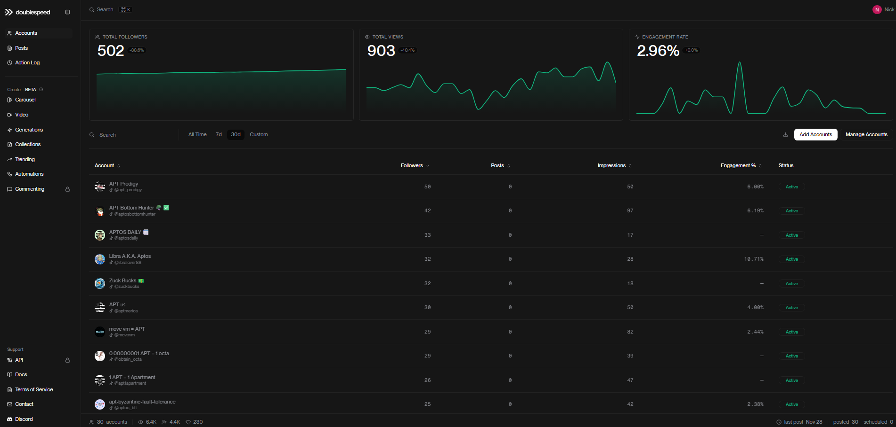

# Stage 7: Publishing

## Distributing Content Across Platforms

## Overview

Once a video exits the pipeline as a finished product — with presenter, visuals, overlays, and captions — the final step is getting it in front of audiences.

Publishing is handled through **DoubleSpeed.ai**, a platform that provides API access to upload and distribute video content across multiple social media platforms from a single integration point.

<figure style="text-align: center;">
  
  <figcaption style="color: gray; font-size: 0.85em; margin-top: 0.5em;">The DoubleSpeed.ai platform — centralized content distribution and automation.</figcaption>
</figure>

---

## Supported Platforms

Through the DoubleSpeed API, finished videos are published to:

- **TikTok**
- **Facebook**
- **Instagram**

This enables a single video to be distributed across all target platforms without manual uploading to each one individually.

---

## Account Management at Scale

DoubleSpeed provides a unified dashboard for managing all accounts in one place — tracking followers, views, engagement rates, and post status across every connected account.

<figure style="text-align: center;">
  
  <figcaption style="color: gray; font-size: 0.85em; margin-top: 0.5em;">The DoubleSpeed dashboard — managing multiple accounts with follower, view, and engagement tracking.</figcaption>
</figure>

The infrastructure currently supports **30 connected accounts** across platforms. The metrics below reflect an **initial validation batch** — a limited test distribution used to verify end-to-end pipeline delivery, confirm platform ingestion, and baseline engagement rates across account cohorts before scaling to full production volume.

<figure style="text-align: center;">
  
  <figcaption style="color: gray; font-size: 0.85em; margin-top: 0.5em;">Initial test batch metrics — 30 accounts — 6.4K views — 4.4K impressions — 230 engagements</figcaption>
</figure>

### Production Throughput Target

With the pipeline validated and distribution infrastructure in place, the system is being tuned for a production cadence of **60 videos per day** across the full account network. This involves optimizing batch scheduling, staggering publish windows for maximum algorithmic reach per platform, and balancing API rate limits across the account pool.

The pipeline's modular architecture makes this scaling straightforward — topic discovery, script generation, and personalization already support multi-account throughput. The remaining optimization is in fine-tuning distribution timing and per-platform delivery parameters.

---

## How It Fits Into the Pipeline

Publishing is the final stage of the content pipeline. It receives the fully produced video from Stage 6 (Captions) and handles the distribution logistics — uploading, platform-specific formatting, and scheduling.

```
Finished Video (from Stage 6)
        |
        v
  +---------------+
  |  DoubleSpeed   |  ──>  TikTok
  |     API        |  ──>  Facebook
  |                |  ──>  Instagram
  +---------------+
```

---

## Details Coming Soon

This section will be expanded to cover:

- How the DoubleSpeed integration works within the pipeline
- Platform-specific considerations
- Scheduling and timing of posts
- Multi-account publishing workflows

---

<p style="text-align: center; color: gray; font-size: 0.85em;">
ALGH — Content Pipeline Automation
</p>
