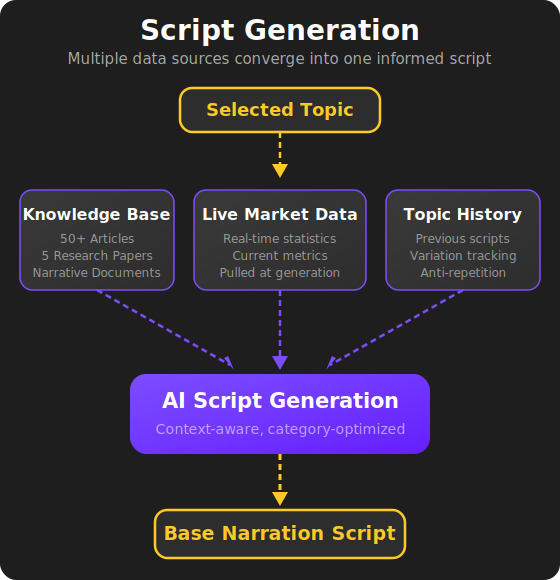

# Stage 2: Script Generation

## Turning a Topic into an Informed Script

Once a topic has been selected, the pipeline needs to produce a narration script — the words that will actually be spoken in the final video. But this isn't just "write something about this topic." The scripts produced by this stage are **research-backed, contextually aware, and designed for short-form video**.

---

## How It Works

### Knowledge Base Retrieval

Every script is grounded in real information. The system maintains a **[curated knowledge base](../knowledge-base.md)** — a collection of technical articles, research papers, and narrative source documents that have been indexed and made searchable.

When a topic comes in, the system queries this [knowledge base](../knowledge-base.md) to pull the most relevant context. The retrieval is intelligent — it doesn't just keyword-match. It understands the category of the topic and selects context that supports the right narrative angle.

The knowledge base includes:

- **50+ technical articles** covering the subject matter in depth
- **Published research papers** from academic sources
- **Narrative and contextual documents** that provide broader framing

This means the scripts aren't surface-level takes. They're informed by a body of knowledge that would take a human researcher significant time to assemble and reference.

### Live Data Integration

In addition to the [knowledge base](../knowledge-base.md), the system pulls **live data** at the time of script generation. This ensures that scripts reference current numbers and statistics rather than stale information.

This combination of curated knowledge and real-time data gives each script both depth and freshness.

### Intelligent Topic Variation

The system tracks what it has written before. When a new topic is similar to a previously covered one, the system recognizes this and adjusts its approach — pulling different context, taking a different narrative angle, and ensuring the output feels distinct.

This prevents the content from becoming repetitive even when covering related subjects over time.

### Script Generation

With the relevant context assembled, the system generates a narration script optimized for short-form video:

- **30–40 seconds** of spoken content
- **Structured for engagement** — hook, body, and call-to-action
- **Conversational tone** — written to be spoken, not read
- **Factually grounded** — claims backed by retrieved knowledge and live data

---

## Why This Matters

Writing a good script for short-form video is harder than it looks. It needs to grab attention immediately, deliver value quickly, and feel natural when spoken aloud. Doing this consistently — while staying factually accurate and topically fresh — is a significant challenge at scale.

This stage handles all of that automatically. Every script is informed by a substantial [knowledge base](../knowledge-base.md), aware of what's been produced before, and structured specifically for the format it will be delivered in.

---

## What Comes Out

The output is a **base narration script** — a clean, structured script ready to be personalized for a specific account in the next stage.

<figure style="text-align: center;">
  
</figure>

---

ALGH — Content Pipeline Automation

