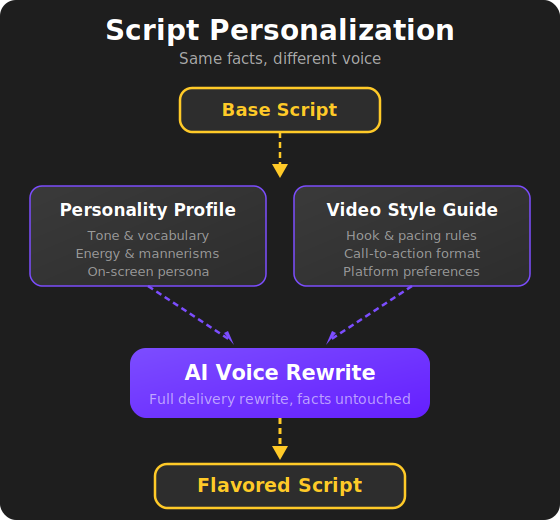

# Stage 3: Script Personalization

## Making It Sound Like *Them*

The base script from Stage 2 is factually solid and well-structured — but it doesn't sound like anyone in particular. This stage takes that script and rewrites it to match the **unique voice, tone, and style** of a specific account.

The facts stay the same. The delivery changes completely.

---

## How It Works

### Account Profiles

Every account in the system has a defined identity, captured in two profile documents:

- **Personality Profile** — Describes *how* the account speaks. This includes tone, vocabulary, energy level, mannerisms, and the overall vibe. Think of it as a character sheet for the account's on-screen persona.

- **Video Style Guide** — Describes *how* the account's videos are structured. This covers things like hook timing, pacing, how the call-to-action is handled, and formatting preferences specific to the platform.

Together, these profiles give the system everything it needs to rewrite a script in a way that feels authentic to the account.

### The Rewrite

Using the account's personality and style profiles as a guide, the system rewrites the base script. This isn't just swapping a few words — it's a full rewrite of the delivery:

- **Sentence structure** adapts to the account's natural rhythm
- **Word choice** reflects how this account would actually talk
- **Energy and pacing** match the account's established style
- **Hook and call-to-action** follow the account's preferred patterns

The core information — the facts, claims, and narrative — remains untouched. What changes is everything about *how* it's communicated.

---

## Why This Matters

This is what makes the multi-account model work. Without personalization, every account would sound the same — clearly automated and generic. With it, each account maintains a **distinct, consistent identity** that audiences recognize and connect with.

It also means a single trending topic can produce **multiple unique videos** across different accounts. Same information, completely different feel. This is essential for operating multiple accounts without the content feeling duplicated or recycled.

---

## What Comes Out

The output is a **personalized (flavored) script** — rewritten in the account's voice, formatted to their style, and ready to be produced as a video in the next stage.

<figure style="text-align: center;">
  
</figure>

---

ALGH — Content Pipeline Automation

