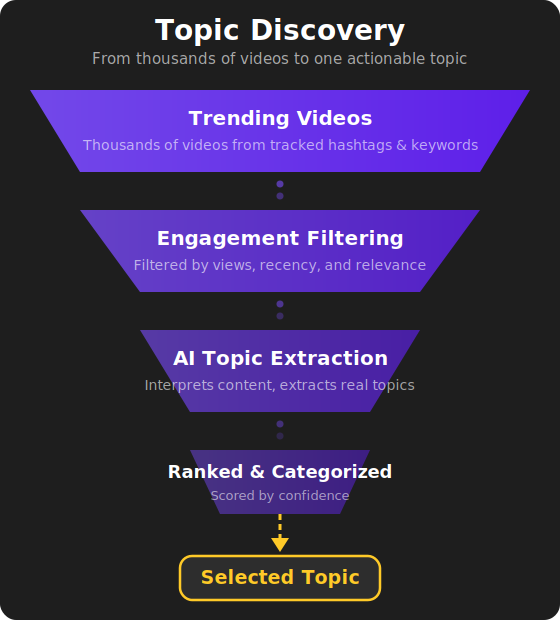

# Stage 1: Topic Discovery

## Finding What's Trending Right Now

The pipeline begins by answering the most fundamental question in content creation: **"What should we talk about today?"**

Rather than relying on guesswork or manually browsing social media, this stage automatically scans platforms for topics that are actively gaining traction — and surfaces the ones most worth covering.

---

## How It Works

### Scanning for Trends

The system monitors TikTok for videos related to the content verticals we operate in. It looks across a defined set of hashtags and keywords that align with our focus areas, pulling in videos that have been posted within a recent time window.

Not every video that's posted is worth paying attention to. The system applies engagement filters to narrow the results down to content that is actually resonating with audiences — filtering by view counts and other engagement signals to separate noise from genuine traction.

### Extracting Topics

Raw video data isn't useful on its own. The system uses AI to analyze the top-performing videos and extract the **actual topics** being discussed. This isn't just keyword matching — it interprets the content to identify what the conversation is really about.

Each extracted topic comes with context:

- **What the topic is** — a clear, actionable description
- **What category it falls into** — regulation, adoption, payments, institutional moves, etc.
- **How confident the system is** — based on how many videos are covering it and how much engagement they're generating

### Topic Selection

The extracted topics are ranked and presented for selection. This is one of the few points in the pipeline where a human makes a decision — choosing which topic to run through the rest of the pipeline.

This intentional human checkpoint ensures the content stays strategically aligned, even though the discovery process itself is fully automated.

---

## Why This Matters

Manual trend monitoring is slow and inconsistent. By the time someone manually identifies a trending topic, researches it, and starts scripting — the window of relevance may have already passed.

This stage compresses what would be hours of manual monitoring into a process that runs in minutes. It ensures the pipeline is always working with topics that are **timely, relevant, and proven to have audience interest**.

---

## What Comes Out

The output of this stage is a **selected topic** with its associated category. This feeds directly into Stage 2, where the topic becomes the foundation for a narration script.

<figure style="text-align: center;">
  
</figure>

---

ALGH — Content Pipeline Automation

